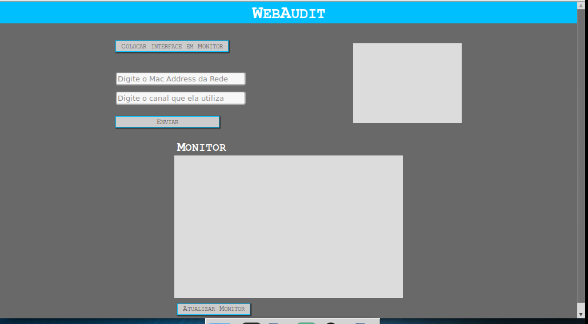

# WebAudit 802.11

> Equipe: Patrick Muller da Costa Dias e Matheus Gabriel Lima de Mendonça

# Objetivo
Segurança em redes sem fio é algum primordial hoje em dia, visto que ela é resposável por grande maioria dos acesso a internet. O projeto visa fornercer um interface Web para que possam ser realizados testes de penatração em redes sem fio que utilizem o tipo de criptografia WEP utilizando o pacote Aircrack-ng do Kali Linux.

# Ideia principal
A ideia principal é:
- Monitorar o tráfedo de uma rede WEP;
- Realizar teste de penatração com a tentiva de descoberta dos dados de acesso a rede;

*Figura 1 - Tela de Login*

*Figura 2 - Tela Principal*

### Alguns [comandos]

#### Coloca placa de rede sem fio no modo monitor
airmon-ng start wlan0
#### Monitora rede que utiliza criptografia WEP no canal 2(neste exemplo)
airodump-ng mon0 --encrypt WEP -w captura -u 2
#### Realiza o procedimento de quebra da senha
aircrack-ng -z  -b <MAC DO AP>  <ARQUIVO>*.cap
